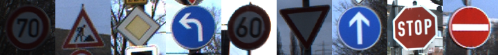
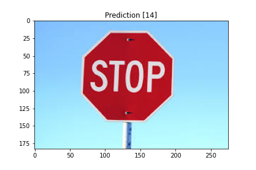

# Traffic Sign Recognition


## Overview

In this project, I will show you how to use Convolutional neural networks to classify traffic signs using the [German Traffic Sign Dataset](http://benchmark.ini.rub.de/?section=gtsrb&subsection=dataset). After the model is trained, the model will be able to classify unseen traffic signs.

## Dataset

The GTSRB dataset (German Traffic Sign Recognition Benchmark) is provided by the Institut für Neuroinformatik group [here](http://benchmark.ini.rub.de/?section=gtsrb&subsection=news). Images are spread across 40 different class of traffic signs and contain a total of 39,209 training images and 12,630 test images .

<p align="center"></p>

1. [Download the dataset](https://s3-us-west-1.amazonaws.com/udacity-selfdrivingcar/traffic-signs-data.zip). 

2. Unzip the dataset into `./data` directory.

## Install  dependencies

  ```sh
  pip install -r requirements.txt
  ```
## Training the model

Run the script train.py to see the training options.

  ```sh
  python train.py --help
  ```
### example : 

  ```sh
  python train.py -data_dir /path/to/dataset -lr 0.001 -batch_size 32 -epochs 15 -save_dir /save/path 
  ```
  There Also a notebook which you can experiment with different parameters in google colab.
 
 [](https://tinyurl.com/y67egah)
## Evaluating the model on the test set

As the model trains, model checkpoints are saved to model.hd5 file to the saved directory(default ./saved). 

  ```sh
  python evaluate.py --data [data_dir] --model [model_file]
  ```

visualization of the model prediction on random image from the internet.
<p align="center"></p>

